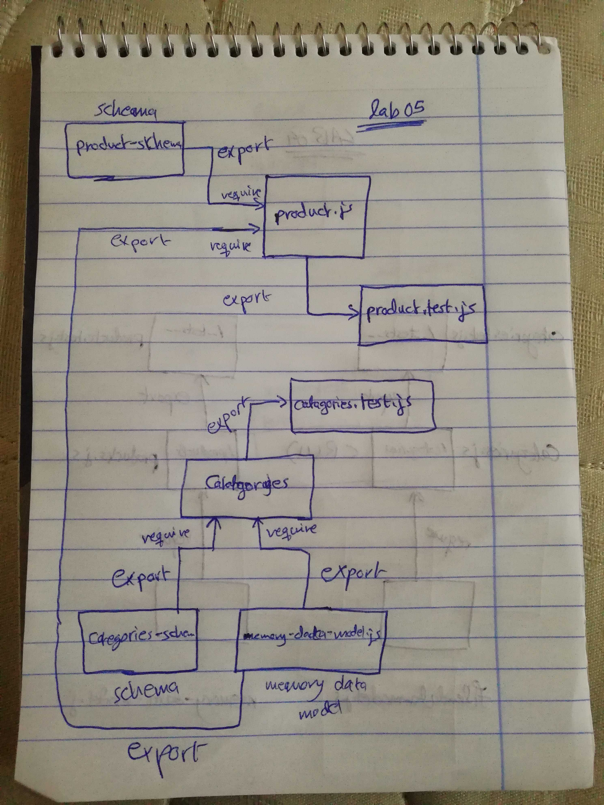

# LAB - Class 05

## Data Modeling With NoSQL Database

### Author: Ahmad K. Al-Mahasneh

### Links and Resources

- [submission PR](https://github.com/401-advanced-javascript-AhmadK/data-modeling-with-noSQL-databases/pull/1)
- [ci/cd](https://github.com/401-advanced-javascript-AhmadK/data-modeling-with-noSQL-databases/actions) (GitHub Actions)

### Setup
- `MONGODB_URI` - mongodb://localhost:27017/lab05db

#### How to initialize/run your application (where applicable)

- npm run start

#### Tests

- How do you run tests?
   npm run test
- Any tests of note?
   jest --verbose --coverage

#### UML

